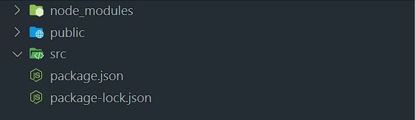
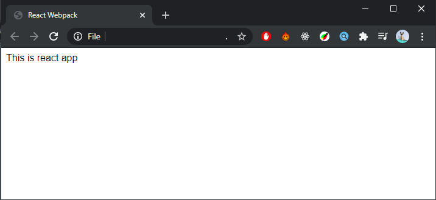

Untuk membuat project react js, kita biasanya menggunkanan `create-react-app`. Kita tidak perlu untuk menginstal dan mengkonfigurasi webpack atau babel, karena sudah diinstall dan dikonfigurasi otomatis pada saat membuat project menggunakan `create-react-app`. Namun, ada kalanya kita ingin menginstall  dan mengkonfigurasi webpack dan react js secara manual agar sesuai dengan kebutuhan dan keinginan kita. Disini saya menggunakan `npm`, jika anda menggunakan `yarn` dapat menyesuaikan. project yang saya buat bernama react-webpack.

### Initialisasi project

```bash
mkdir react-webpack
cd react-webpack
npm init
```

Kemudian buat struktur folder seperti berikut:




### Menginstall dan mengkonfigurasi webpack dan babel

Selanjutnya kita menginstall [webpack](https://webpack.js.org/) 
```bash
npm i webpack webpack-cli --save-dev
```

Kemudian saya akan menggunakan [babel](https://babeljs.io/) sebagai transcompiler nya
```bash
npm i @babel/core babel-loader @babel/preset-env @babel/preset-react --save-dev
```

Lalu buat file `.babelrc` di folder utama untuk mengkonfigurasi preset react pada babel, sebagai berikut.
```
{
  "presets": ["@babel/preset-env", "@babel/preset-react"]
}
```

Lalu buat juga konfigurasi webpack di file bernama `webpack.config.js`, lalu buat konfigurasi seperti ini.

```js
const path = require("path")

module.exports = {
  entry: "./src/index.js",
  output: {
    path: path.join(__dirname, 'public'),
    filename: "bundle.js"
  },
  module: {
    rules: [
      {
        test: /\.(js|jsx)$/,
        exclude: /node_modules/,
        loader: 'babel-loader'
      },
    ]
  },
  devtool: "cheap-module-eval-source-map"
}
```

Disini kita mengkonfigurasi agar webpack meload semua file __.JS__ dan __.JSX__ kecuali difolder `node_modules` menggunakan babel. File __.JS__ dan __.JSX__ yang diload memiliki entry point di `/src/index.js` dan akan menghasilkan 1 file bundle ke dalam folder public yang bernama `bundle.js`. file `bundle.js` inilah yang akan kita load pada halaman static html kita.


Kemudian buat sebuah file `index.html` di folder `public`. Lalu isi dengan code html sederhana seperti berikut. Jangan lupa untuk membuat sebuah `div` dengan id `#root` yang akan kita gunakan sebagai container di aplikasi react yang akan kita buat.

```html
<!DOCTYPE html>
<html lang="en">
<head>
  <meta charset="UTF-8">
  <meta name="viewport" content="width=device-width, initial-scale=1.0">
  <title>React-Webpack</title>
</head>
<body>
  <div id="root"></div>
  <script src="./bundle.js"></script>
</body>
</html>
```

### Menginstall react js

Selanjutnya menginstall react js sebagai dependencies

```bash
npm i react react-dom --save
```

Sekarang buat file `index.js` di folder `src`, lalu buat component react sederhana seperti berikut.
```
import React from "react"
import ReactDom from "react-dom"

const App = () => {
  return (
    <div id="app">
      This is react app
    </div>
  )
}

ReactDom.render(<App/>, document.getElementById("root"))
```

Kemudian tambahkan/edit beberapa script di file `package.json`.

```json
"scripts": {
  "start": "webpack --mode=development",
  "build": "webpack --mode=production"
},
```
Selanjutnya kita bisa menjalankan script yang telah dibuat
```
npm run start
```
Perintah diatas akan membuat sebuah bundle di folder `public` dari component react yang kita buat. Lalu jika kita buka file `index.html` yang telah kita buat sebelumnya di web browser, maka akan muncul seperti berikut.



### Menginstall dan konfigurasi webpack-dev-server

Sebenarnya pada tahap sebelumnya, kita sudah bisa membuat project berbasis menggunakan react js. Namun, hal itu belum efektif. Oleh karena itu, kita buat local server sehingga kita bisa membuat project kita dan melihat perubahannya secara realtime tanpa harus selalu membuild-nya. Kita akan menggunakan `webpack-dev-server`. Untuk menginstallnya sebagai berikut

```
npm i webpack-dev-server --save-dev
```

Lalu tambahkan tambahkan beberapa baris di file `webpack.config.js` yang sebelumnya sudah kita buat.
```js
const path = require("path")

module.exports = {
  entry: "./src/index.js",
  output: {
    path: path.join(__dirname, 'public'),
    filename: "bundle.js"
  },
  module: {
    rules: [
      {
        test: /\.(js|jsx)$/,
        exclude: /node_modules/,
        loader: 'babel-loader'
      },
    ]
  },
  devtool: "cheap-module-eval-source-map",
  devServer: {
    contentBase: path.join(__dirname, 'public')
  }
}
```

Tambahkan pula script pada `package.json`
```json
"scripts": {
  "start": "webpack --mode=development",
  "build": "webpack --mode=production",
  "dev-server": "webpack-dev-server"
},
```
Selanjutnya kita bisa menjalankan script yang telah dibuat
```
npm run dev-server
```
Ketika server nya sudah hidup, kita bisa membuka project kita di [http://localhost:8080/](http://localhost:8080/) secara default. Apabila ada perubahan yang terjadi pada project kita maka akan terubah secara otomatis.

### Konfigurasi file css atau scss

Satu lagi yang tidak kalah penting adalah `css`, `sass` atau `scss`, tergantung mana yang akan anda gunakan. Pada step-step sebelumnya, kita masih mendapatkan error ketika meng-import file `css`, `sass` atau `scss`. Untuk itu kita harus menginstall beberapa package terlebih dahulu

Jika hanya mengguanakan `css` saja.
```bash
npm i css-loader style-loader --save-dev
```
Lalu tambahakan beberapa rules di file `webpack.config.js`
```js
const path = require("path")

module.exports = {
  entry: "./src/index.js",
  output: {
    path: path.join(__dirname, 'public'),
    filename: "bundle.js"
  },
  module: {
    rules: [
      {
        test: /\.(js|jsx)$/,
        exclude: /node_modules/,
        loader: 'babel-loader'
      },
      {
        test: /\.(css)$/,
        loader: ['style-loader','css-loader']
      },
    ]
  },
  devtool: "cheap-module-eval-source-map",
  devServer: {
    contentBase: path.join(__dirname, 'public')
  }
}
```

Misalkan kita akan meng-import sebuah file css di aplikasi kita. Buat sebuah file css kemudian kita bisa meng-import nya seperti berikut. Sebagai contoh menggunakan file `index.js` yang telah dibuat.
```
import React from "react"
import ReactDom from "react-dom"
import "./index.css

const App = () => {
  return (
    <div id="app">
      This is react app
    </div>
  )
}

ReactDom.render(<App/>, document.getElementById("root"))
```

Lalu jika akan menggunakan `scss`, kita harus menginstall package tambahan lagi sebagai berikut
```
npm i sass-loader node-sass --save-dev
```
Lalu konfigurasi ulang file `webpack.config.js` dengan merubah rules sebagai berikut
```js
const path = require("path")

module.exports = {
  entry: "./src/index.js",
  output: {
    path: path.join(__dirname, 'public'),
    filename: "bundle.js"
  },
  module: {
    rules: [
      {
        test: /\.(js|jsx)$/,
        exclude: /node_modules/,
        loader: 'babel-loader'
      },
      {
        test: /\.(css)$/,
        loader: ['style-loader','css-loader']
      },
      {
        test: /\.scss$/,
        use: ['style-loader', 'css-loader', 'sass-loader']
      }
    ]
  },
  devtool: "cheap-module-eval-source-map",
  devServer: {
    contentBase: path.join(__dirname, 'public')
  }
}
```

Sekarang kita bisa menggunakan `css` maupun `scss` dengan langsung meng-importnya kedalam aplikasi kita. Selamat mencoba dan selamat berkarya, Happy Coding!!