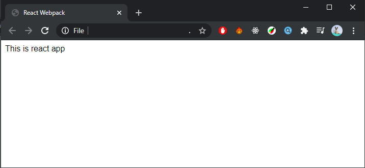

To make react js project we can use `create-react-app`, so we don't need to install or configure tools like webpack and babel. It will preconfigured and hidden. But if we prefer setup react project manually from scratch, We can install a toolchain like webpack as bunlder and babel as compiler. Today I wanna share my way how to do it. I use `npm` as package manager, you can use `yarn` too. The first things we need to do is make `node.js` project.

```
mkdir react-webpack
cd react-webpack
npm init
```

Now make folder structures like this


On public folder creat new file `index.html` and add simple HTML code like this.

```html
<!DOCTYPE html>
<html lang="en">
<head>
  <meta charset="UTF-8">
  <meta name="viewport" content="width=device-width, initial-scale=1.0">
  <title>React-Webpack</title>
</head>
<body>
  <div id="root"></div>
  <script src="./bundle.js"></script>
</body>
</html>
```

we use `#root` element as root of our react app and all Javascript code of our react project is loaded on `bundle.js` that created by webpack automatically when we build the project. After that, install [webpack](https://webpack.js.org/) and [babel](https://babeljs.io/) as dev-dependencies, and install react js as dependencies
```
npm i webpack webpack-cli --save-dev
npm i @babel/core babel-loader @babel/preset-env @babel/preset-react --save-dev
npm i react react-dom --save
```
Once dependecies are done installing add following npm script in `package.json`. This script will be used to build and run our project.

```json
...
"scripts": {
  "start": "webpack --mode=development",
  "build": "webpack --mode=production"
},
...
```

Create babel configuration file `.babelrc` in your root project directory and add following lines of code.
```
{
  "presets": ["@babel/preset-env", "@babel/preset-react"]
}
```

And create webpack configuration file `webpack.config.js` too in your base directory and add following code

```javascript
const path = require("path")

module.exports = {
  entry: "./src/index.js",
  output: {
    path: path.join(__dirname, 'public'),
    filename: "bundle.js"
  },
  module: {
    rules: [
      {
        test: /\.(js|jsx)$/,
        exclude: /node_modules/,
        loader: 'babel-loader'
      },
    ]
  },
  devtool: "cheap-module-eval-source-map"
}
```

Now we can load all __.JS__ or __.JSX__ files throught babel-loader from entry point `src/index.js`. All js file or dependecies that we import in `index.js` or any js file inside it will be loaded and will be bundled to `bundle.js` in `public` folder. 

Next we create new react component as entry point of our react project. Create `index.js` in `src` folder, and add following lines of code. 

```
import React from "react"
import ReactDom from "react-dom"

const App = () => {
  return (
    <div id="app">
      This is react app
    </div>
  )
}

ReactDom.render(<App/>, document.getElementById("root"))
```

Now to run our project we can use
```
npm run start
```

Now we can see `bundle.js` file that created automatically in `public` folder. And if we open `index.html` in browser we can see like this.



### Install webpack-dev-server

For development mode we can use webpack-dev-server to run our project in local server. When we start the `webpack-dev-server` anythings changes to our code will be loaded automatically, so we don't have to build everytime. To install `webpack-dev-server` like this

```
npm i webpack-dev-server --save-dev
```

After that update `webpack.config.js`, add devServer to it.
```javascript
const path = require("path")

module.exports = {
  entry: "./src/index.js",
  output: {
    path: path.join(__dirname, 'public'),
    filename: "bundle.js"
  },
  module: {
    rules: [
      {
        test: /\.(js|jsx)$/,
        exclude: /node_modules/,
        loader: 'babel-loader'
      },
    ]
  },
  devtool: "cheap-module-eval-source-map",
  devServer: {
    contentBase: path.join(__dirname, 'public')
  }
}
```

Next add `dev-server` script in `package.json` 
```json
"scripts": {
  "start": "webpack --mode=development",
  "build": "webpack --mode=production",
  "dev-server": "webpack-dev-server"
},

```
Now we can run our project on local server, like this
```
npm run dev-server
```

When the server is open, we can open our project in web browser, default in [http://localhost:8080/](http://localhost:8080/).


### Add style configuration

Now when we import `css`, `sass`, or `scss` file we got an error, because webpack doesn't know how to load it. We must install some package and add style confiuration.

If we just use `css` file instead of `scss` or `sass`. we can just install `css-loader` and `style-loader`
```
npm i css-loader style-loader --save-dev
```
and add some rules in `webpack.config.js`
```javascript
const path = require("path")

module.exports = {
  entry: "./src/index.js",
  output: {
    path: path.join(__dirname, 'public'),
    filename: "bundle.js"
  },
  module: {
    rules: [
      {
        test: /\.(js|jsx)$/,
        exclude: /node_modules/,
        loader: 'babel-loader'
      },
      {
        test: /\.(css)$/,
        loader: ['style-loader','css-loader']
      },
    ]
  },
  devtool: "cheap-module-eval-source-map",
  devServer: {
    contentBase: path.join(__dirname, 'public')
  }
}
```

To use `css`, just import the file. example in `index.js` add following line
```
...
import "./stlye.css
...
```
after that create `style.scss` file in the same folder. If you wanna use `scss` or `sass` file, after install `css-loader` and `style-loader`, you must install `sass-loader` and `node-sass`. 

```
npm i sass-loader node-sass --save-dev
```

After that add rule to `webpack.config.js` to load all `scss` and `sass` file
```javascript
const path = require("path")

module.exports = {
  entry: "./src/index.js",
  output: {
    path: path.join(__dirname, 'public'),
    filename: "bundle.js"
  },
  module: {
    rules: [
      {
        test: /\.(js|jsx)$/,
        exclude: /node_modules/,
        loader: 'babel-loader'
      },
      {
        test: /\.(css)$/,
        loader: ['style-loader','css-loader']
      },
      {
        test: /\.(scss|sass)$/,
        use: ['style-loader', 'css-loader', 'sass-loader']
      }
    ]
  },
  devtool: "cheap-module-eval-source-map",
  devServer: {
    contentBase: path.join(__dirname, 'public')
  }
}
```

Now you can continue creating make a new things with react. Happy Coding!!