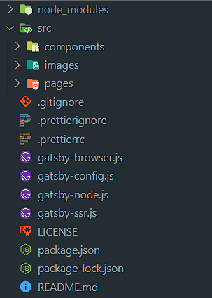
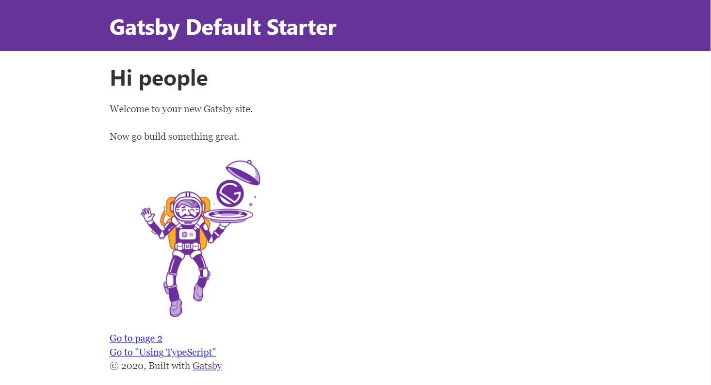
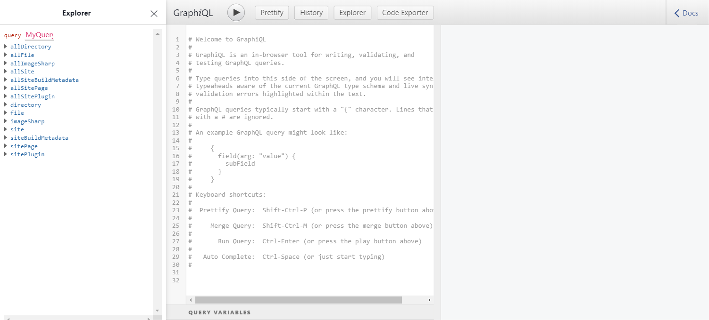
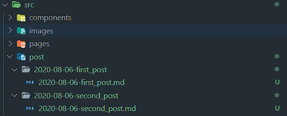
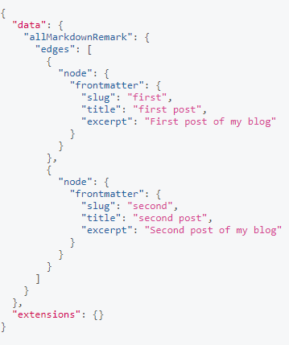
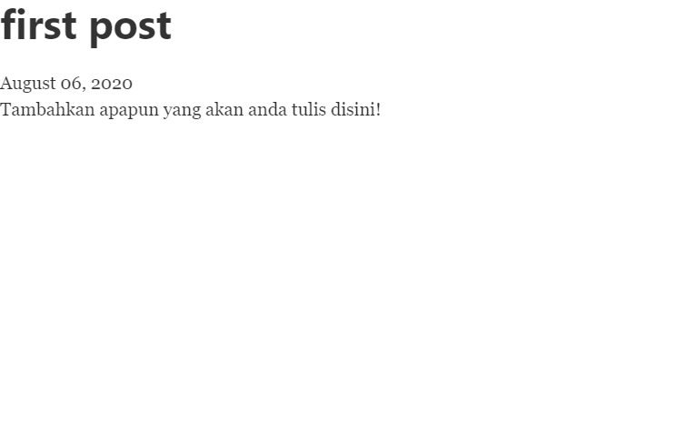

Sekarang membuat blog tidaklah lagi sulit. Dengan bantuan seperti wordpress dan sebagainya hal itu mudah dilakukan. Namun, ada kalanya kita ingin membuat blog yang sesuai keinginan kita dengan semua konfigurasinya sendiri. Salah satu cara yang dapat digunakan adalah dengan membuat sebuah blog dengan markdown sebagai dasarnya. Dengan demikian, bagi yang sudah akrab dengan menulis di markdown pasti akan sangat terbantu. Blog ini juga dibuat dari markdown dengan menggunakan [Gatsby.js](https://www.gatsbyjs.org/). Mengapa menggunakan Gatsby.Js? karena dengan menggunakan gatsby.js memiliki banyak kelebihan:

- Cepat
- Memiliki banyak plugin
- Bisa me-load data dari mana saja, karena gatsby.js menggunakan [GraphQL](https://graphql.org/)
- Sudah memiliki image optimization, lazy loading, dsb

Gatsby.js berbasis [React.js](https://reactjs.org/), sehingga bagi anda yang sudah terbiasa menggunakan react.js pasti dapat dengan mudah memahaminya.

### Pre-requisites

- Memahami HTML, css, Javascript, react.js
- Sudah terinstall node.js dan `npm` atau `yarn`

### Instalasi Gatsby-CLI

Untuk menggunakan gatsby kita harus menginstall `gatsby-cli` secara global terlebih dahulu

```
npm i -g gatsby-cli
```

### Membuat project gatsby

Setelah menginstall `gatsby-cli`, untuk membuat sebuah project gatsby dapat dilakukan seperti berikut

```
gatsby new my-blog
cd my-blog
```

Setelah berhasil menginstall, maka struktur project default kita akan berbentuk seperti berikut.



Untuk menjalankan project nya bisa dilakukan dengan 

```
cd my-blog
gatsby develop
```
Lalu buka [http://localhost:8000/](http://localhost:8000/) menggunakan browser. Maka akan ada tampilan default seperti berikut. Defaultnya akan berjalan pada port 8000.



Untuk query GraphQL dapat dilakukan pada GraphiQL di [http://localhost:8000/___graphql](http://localhost:8000/___graphql). Sehingga kita bisa mendapatkan data yang tepat untuk nanti digunakan di dalam aplikasi yang akan kita buat.



### Menginstall plugin yang dibutuhkan

Dalam membuat markdown blog ini, ada beberapa step yang diperlukan, yaitu:
 - Membaca file yang ada filesystem
 - Merubah markdown kedalam HTML dan frontmatter

Untuk membaca file markdown yang akan kita buat nanti dibutuhkan plugin `gatsby-source-filesystem`. Bisa diinstall sebagai berikut.

```
npm i gatsby-source-filesystem --save
```

Lalu untuk merubah file markdown yang akan kita buat kedalam HTML dan frontmatter, kita membutuhkan plugin `gatsby-transformer-remark`.

```
npm i gatsby-transformer-remark --save
```

Kemudian tambahkan konfigurasi plugin pada `gatsby-config.js` seperti berikut.

```javascript
...
plugins: [
...
  `gatsby-transformer-remark`,
  {
    resolve: `gatsby-source-filesystem`,
    options: {
      path: `${__dirname}/src/post`,
      name: `post`,
    },
  },
],
...
```

### Membuat halaman markdown

Buat sebuah folder `/src/post`. Folder ini akan digunakan untuk menampung semua post berbentuk markdown di website yang akan kita buat. Disini saya akan membuat 2 buah halaman markdown sebagai percobaan. Buat 2 buah folder dan file markdown di masing-masing folder tersebut, sebagai contoh saya menggunakan format year-month-date-Title agar lebih mudah dalam pengurutannya.



Untuk setiap file markdown yang akan kita gunakan, harus kita tambahkan frontmatter yaitu metadata yang berguna dalam query nanti. Tambahkan minimal data seperti berikut di bagian atas setiap file markdown, edit sesuai kebutuhan.

```markdown
---
slug: "first"
date: '2020-08-06'
title: 'first post'
excerpt: 'First post of my blog'
---

Tambahkan apapun yang akan anda tulis disini!
```

Dari beberapa data tersebut, `slug` digunakan untuk membuat route dari post kita, sehingga namanya harus unik agar tidak terjadi masalah. Pada contoh diatas, `slug` nya adalah first maka nanti markdown `first_post.md` akan ditampilkan di halaman [http://localhost:8000/first/](http://localhost:8000/first/). Sebagai contoh penggunaan, buka [GraphiQL](http://localhost:8000/___graphql) dan buat query seperti berikut

```graphql
{
  allMarkdownRemark{
    edges {
      node {
        frontmatter {
          slug
          date
          title
          excerpt
        }
      }
    }
  }
}
```

Maka akan menghasilkan seperti berikut



Lalu untuk membuat halaman markdown, kita harus membuat sebuah template yang akan digunakan. Buat folder `src/templates` lalu buat React Component sederhana di file `BlogPost.js` seperti berikut.

```Javascript
import React from "react"
import { graphql } from "gatsby"

const BlogPost = ({ data }) => {
  const { frontmatter, html } = data.markdownRemark
  return (
    <div>
      <h1>{frontmatter.title}</h1>
      <div>{frontmatter.date}</div>
      <div dangerouslySetInnerHTML={{ __html: html }}/>
    </div>
  )
}

const pageQuery = graphql`
  query($slug: String!) {
    markdownRemark(frontmatter: { slug: { eq: $slug } }) {
      html
      frontmatter {
        date(formatString: "MMMM DD, YYYY")
        slug
        title
        excerpt
      }
    }
  }
`

export default BlogPost
export { pageQuery }
```

Lalu buka file `gatsby-node.js` dan tambahkan konfigurasi seperti berkut ini untuk membuat halaman blog.

```javascript
exports.createPages = async ({ actions, graphql }) => {
  const { createPage } = actions

  const post = await graphql(`
    {
      allMarkdownRemark{
        edges {
          node {
            frontmatter {
              slug
            }
          }
        }
      }
    }
  `)

  post.data.allMarkdownRemark.edges.forEach(({ node }) => {
    createPage({
      path: `/${node.frontmatter.slug}`,
      component: require.resolve(`./src/templates/BlogPost.js`),
      context: {
        slug: node.frontmatter.slug,
      },
    })
  })
}
```

Maksud dari konfigurasi ini adalah, semua hasil query pada `post` akan dibuat sebuah page dengan route nya adalah `/slug` dan meload component `BlogPost.js` untuk masing masing post. Lalu jalankan `gatsby develop` lagi dan buka [http://localhost:8000/first/](http://localhost:8000/first/) atau sesuai `slug` yang anda buat tadi maka akan muncul seperti berikut.



Proses membuat halaman markdown sudah selesai, selanjutnya anda tinggal mengedit template `BlogPost.js` tersebut sesuai keinginan anda.

> Kalau bingung kenapa ada error, coba jalankan `gatsby clean` kemudian `gatsby develop` lagi. Terkadang kita harus menghapus cache dan build nya. Jangan tanya kenapa.


### Membuat Index All Post

Satu lagi yang harus kita buat adalah membuat homepage atau index page yang memuat semua post yang kita buat. Sekarang buka file `index.js` di `src/pages/`. Dan edit file tersebut sekiranya seperti berikut. (ini hanya contoh)

```javascript
import React from "react"
import { graphql, Link } from "gatsby"

const Index = ({ data }) => {
  const { edges } = data.allMarkdownRemark
  return (
    <div>
      <h1>All Post</h1>
      <div id="all-post-container">
        {edges.map(edge => {
          const { frontmatter } = edge.node
          const { slug, title, excerpt } = frontmatter
          return (
            <div key={slug}>
              <Link to={`/${slug}`}>
                <h3>{title}</h3>
              </Link>
              <h5>{excerpt}</h5>
            </div>
          )
        })}
      </div>
    </div>
  )
}

const query = graphql`
  query HomePageQuery {
    allMarkdownRemark {
      edges {
        node {
          id
          frontmatter {
            title
            slug
            excerpt
          }
        }
      }
    }
  }
`

export default Index
export { query }
```

Sehingga tampilan awal nya akan menjadi seperti ini


Dari file `index.js` ini kita melakukan query seluruh post yang ada di blog kita, kemudian menampilkannya. Hasil dari query tersebut otomatis di inject oleh Gatsby, sehingga tidak perlu konfigurasi ulang.

Demikianlah tutorial membuat markdown blog menggunkan gatsby. Semua yang diberikan masih konsep nya saja, tinggal mengembangka seperti style dan sebagainya. Sampai pada step ini, blog ini masih memiliki kekurangan yaitu belum bisa menampilkan gambar yang ada di file markdown. Hal itu akan dibahas di post berikutnya. Terima kasih!!