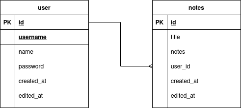

Beberapa waktu yang lalu saya mencoba untuk belajar membuat REST API dan menggunakannya di client side menggunakan Flask dan React JS. Saya coba membaca tutorial dari [@kiddyxyz](https://medium.com/@kiddy.xyz/tutorial-restful-api-dengan-flask-python-part-1-pengenalan-instalasi-4836478ce651) untuk artikel tentang Flask REST API, kemudian saya mencoba membuat frontedn menggunakan React JS, banyak hal yang saya dapat dari hal tersebut. Saya bisa lebih memahami bagaimana cara kerja REST API, jwt web token, HTTP header, HTTP response code, dan lain sebagainya. Pada kesempatan kali ini saya akan berbagi apa yang saya dapat dengan membuat sebuah aplikasi pembuatan catatan (*taking notes app*) sederhana yang mengimplementasikan REST API, dilengkapi dengan CRUD, authorization, dan authentication. Untuk tutorialnya akan saya bagi menjadi beberapa part agar lebih mudah dan tidak kepanjangan. List tutorialnya seperti ini:

1. Part 0 : [Project Requirements + Project Design](/post/project-requirements-and-project-design)
2. Part 1 : [Setting project untuk backend dan Hello word](/post/setting-project-untuk-backend-dan-hello-word-flask)
3. Part 2 : [Membuat koneksi database, Model dan, migration ke database](/post/membuat-koneksi-database-model-dan-migration-ke-database)
4. Part 3 : [Membuat HTTP response status code yang akan digunakan](/post/membuat-HTTP-response-status-code-yang-akan-digunakan)
5. Part 4 : [Membuat Controller untuk masing-masing Model](/post/membuat-controller-untuk-masing-masing-model)
6. Part 5 : [Membuat endpoint dari REST API dan testing API yang sudah dibuat](/post/membuat-endpoint-dari-REST-API-dan-testing-API-yang-sudah-dibuat)
7. Part 6 : [Mengimplementasi authorization dan authentication dengan JWT](/post/mengimplementasi-authorization-dan-authentication-dengan-JWT)
8. Part 7 : [Setting project untuk frontend dan Membuat routing halaman di frontend](/post/setting-project-untuk-frontend-dan-Membuat-routing-halaman-di-frontend)
9. Part 8 : [Membuat API Consumer untuk di frontend dan Auth System](/post/membuat-API-consumer-untuk-di-frontend-dan-Auth-System)
10. Part 9 : [Membuat Component yang dibutuhkan di frontend dan Mengkonsum API di frontend](/post/membuat-component-yang-dibutuhkan-di-frontend-dan-mengkonsum-API-di-frontend)


### Software

Sebelum memulai membuat project ini, kita harus sudah menginstall beberapa aplikasi atau tools dibawah ini.

- Text Editor. Saya menggunkan Visual Studio Code dalam membuat aplikasi ini, anda dipersilahakan menggunakan text editor/IDE yang anda sukai.
- Python 3
- Node js ≥12
- MySQL, untuk database yang digunakan pada kesempatan kali ini adalah MySQL maka harus sudah terinstall terlebih dahulu sebelum memulai project ini.
- Insomnia. Aplikasi ini kita pakain untuk mencoba REST API yang kita buat sebelum kita pakai di backend. Anda juga bisa menggunakan aplikasi lain yang serupa, seperti Postman dsb.

Saya anggap kita  sudah paham dasar-dasar pemrograman di Python, Javascript, dan React JS. Pada tutorial kali ini, saya sudah menganggap kita sudah paham tentang apa itu REST API dan cara kerjanya. Jika anda belum tau apa itu REST API anda bisa membaca-baca dulu apa itu REST API. Sebelum memulai suatu project, kita harus mendesain database yang digunakan dan API Endpoint yang akan dibuat, dsb.  Pada tutorilal kali ini juga, saya akan menggunakan Model dan Controller, sama seperti MVC tapi tidak ada view nya saja.

### Database

Karena ini hanya tutorial sederhana, saya hanya menggunakan 2 tabel saja. Tabel yang akan saya gunakan adalah tabel `user` untuk menampung data user dan tabel `notes` untuk menampung data notes dari para user. Kira-kira begini desain database yang akan saya buat nanti.



### API Endpoints

Untuk api endpoints, saya membuat beberapa yang saya butuhkan saja, anda bebas menambah atau mengurangi, tergantung selera 😄.

```
POST   /api/users/login
POST   /api/users/signup
GET    /api/users/<id>

POST   /api/notes
GET    /api/notes
GET    /api/notes/<id>
PUT    /api/notes/<id>
DELETE /api/notes/<id>
```

Setelah membuat desain database dan endpoint yang akan kita gunakan, kita tinggal mengikutinya saja dalam mebuat projek ini. 