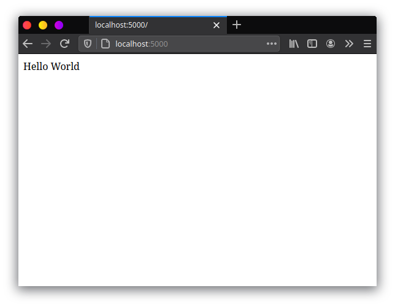

### Membuat virtual environments

Pastikan anda sudah menginstall Python 3. Dalam membuat project ini, disarankan untuk menggunakan **virtual environments**. Gunanya buat apa sih?? ya biar project python kita 'terisolasi' jadi apapun yang akan kita install nanti di project kita hanya terinstall di virtual environment nya saja. Pada saat tutorial ini dibuat saya menggunakan Python versi 3.8, `pip`, package manager nya Python, versi 20.0.2 dan saya menggunkan Ubuntu 20.04.

```bash
~$ python3 --version
Python 3.8.2

~$ pip --version
pip 20.0.2
```

Pertama siapkan folder kosong untuk project kita. Oke sekarang kita bisa membuat virtual environments di folder project kita, dengan menggunkan command seperti berikut untuk linux

```bash
python3 -m venv env
```

dan seperti ini jika anda menggunakan windows

```bash
python3 -m venv env
```

ini akan membuat sebuah folder `env` yang isinya virtual environments kita. Setelah membuat virtual environtments nya, untuk menggunankannya kita harus mengaktifkannya dulu, saya sarankan anda menggunakan console dalam melakukannya. Untuk di Linux

```bash
source env/bin/activate
```

Untuk di Windows

```bash
.\env\Scripts\activate
```

Selanjutnya setelah virtual environtments nya aktif, saya membuat struktur folder untuk project kita sebagai berikut.

```bash
├── app
│   ├── controller
│   ├── model
│   ├── static
│   └── templates
├── env
└── src
```

`env` adalah folder yang kita buat tadi, jadi tidak usah di ganggu wkwk. `src` adalah folder untuk menampung frontend kita nanti jadi kita buat aja terlebih dahulu saja. `app` adalah folder yang akan kita gunakan sebagai root dari projct flask kita. Jadi semua file project backend kita akan ada difolder ini. Dan di dalam folder `app` ada beberap folder yang ada gunanya masing masing 😄 `controller` untuk Controller kita, `model` untuk semua model yang kita buat. `static` akan kita buat untuk menampung file static dari frontend kita, dan `templates` hanya berisi file html yang akan kita gunakan sebagai base untuk aplikasi frontend kita. Jika anda belum paham, gpp nanti juga paham sendiri, wkkw.

### Menginstall package yang dibutuhkan

Sebelum memulai kita akan menginstall beberapa package yang dibutuhkan dulu. Kita install dulu flask nya

```bash
pip install flask 
```

Karena kita akan menggunakan MySQL, kita install packages berikut ini agar kita nanti bisa menggunakan MySQL dan SQL nya.

```bash
pip install flask-sqlalchemy pymysql
```

Selanjutnya kita akan menginstall `flask-migrate` untuk nanti melakukan migration ke database.

```bash
pip install flask-migrate
```

Lalu agar kita bisa menggunakan JSON web token, kita install juga `flask-jwt-extended`.

```bash
pip install flask-jwt-extended cryptography
```

Untuk memudahkan dalam pembuatan project ini, untuk konfigurasi seperti database dsb, saya akan buat disebuah file `env`. Oleh karena itu, kita harus menginstall `python-dotenv.`

```bash
pip install python-dotenv
```

### Membuat konfigurasi projek backend

Untuk mempermudah saat development dan production, jadi kita tidak seting-setting hal yang sama berulang ulang wkwk. Kita buat file `.flaskenv` di root folder dan isikan kode berikut.

```
FLASK_APP= main.py
FLASK_ENV=development

DB_HOST= localhost
DB_DATABASE= notes
DB_USERNAME= root
DB_PASSWORD= password
```

untuk nama database, username, dan password, sesuaikan dengan milik anda ya 😄. Lalu buat file `main.py` di root folder juga, dan isikan 

```python
from app import app
```

iya, gitu aja isinya, biar flask nya nanti tau mana yang dipanggil waktu dijalankan. Nah sekarang kita buat juga sebuah class `Config` kita buat ini buat ngebaca konfigurasi yang kita buat di `.flaskenv` tadi, kayak konfigurasi database nya. Sekarang buat file `config.py` masih di root folder, lalu isikan

```python
import os

class Config(object):
    HOST = str(os.environ.get("DB_HOST"))
    DATABASE = str(os.environ.get("DB_DATABASE"))
    USERNAME = str(os.environ.get("DB_USERNAME"))
    PASSWORD = str(os.environ.get("DB_PASSWORD"))
    SQLALCHEMY_DATABASE_URI = 'mysql+pymysql://' + USERNAME + ':' + PASSWORD + '@' + HOST + '/' + DATABASE

    SQLALCHEMY_TRACK_MODIFICATIONS = False
    SQLALCHEMY_RECORD_QUERIES = True
```

### Hello world

Setelah menginstall Flask dan membuat konfigurasinya, sekarang kita buat hello word di aplikasi flask yang akan kita buat. Pertama buat file `__init__.py` di folder `app`. Lalu isikan kode berikut

```python
from flask import Flask
from config import Config

app = Flask(__name__)
app.config.from_object(Config)

@app.route('/')
def hello():
   return "hello World"
```

Lalu buka terminal atau cmd, dan jalankan `flask run` di project kita. Jangan lupa virtual environments nya diaktifkan jika belum diaktifkan. Setelah itu, buka [`http://localhost:5000/`](http://localhost:5000/) di browser maka akan muncul seperti berikut.



Sekarang kita sudah bisa membuat hello word di project kita. Selanjutnya kita akan membuat koneksi ke database, Model, dan migration nya pada part selanjutnya.