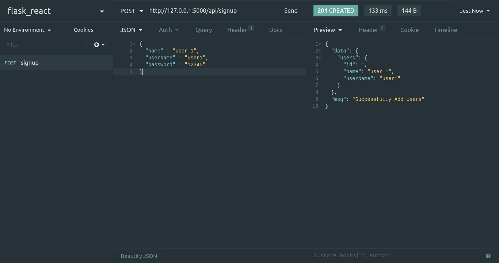
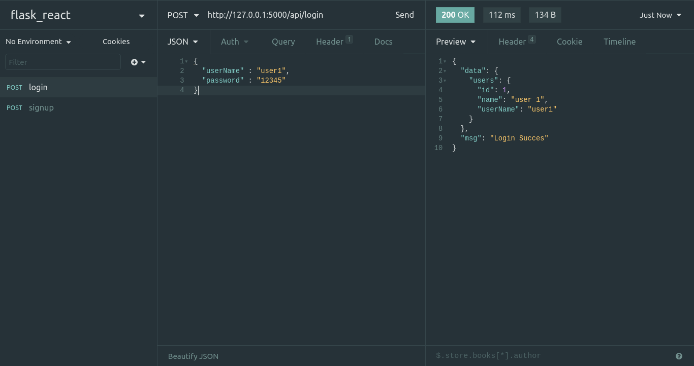
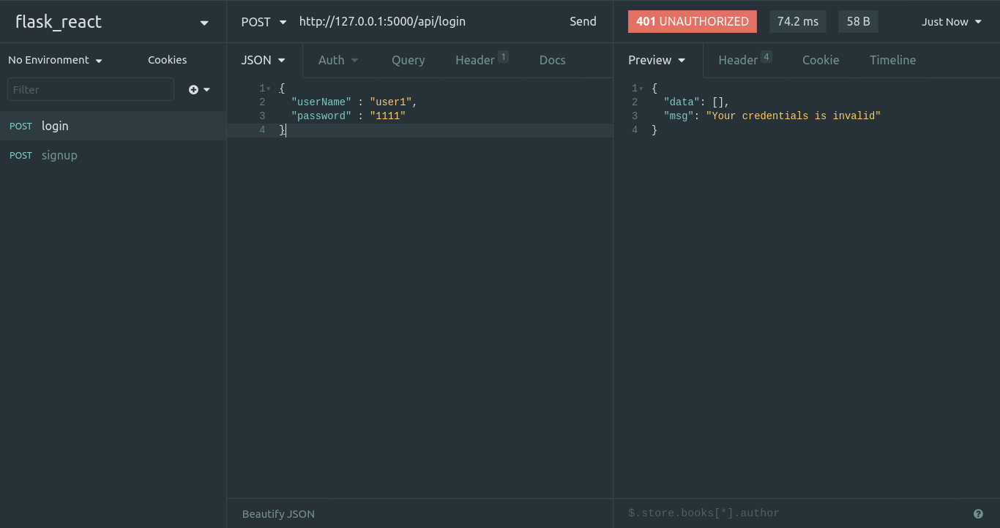
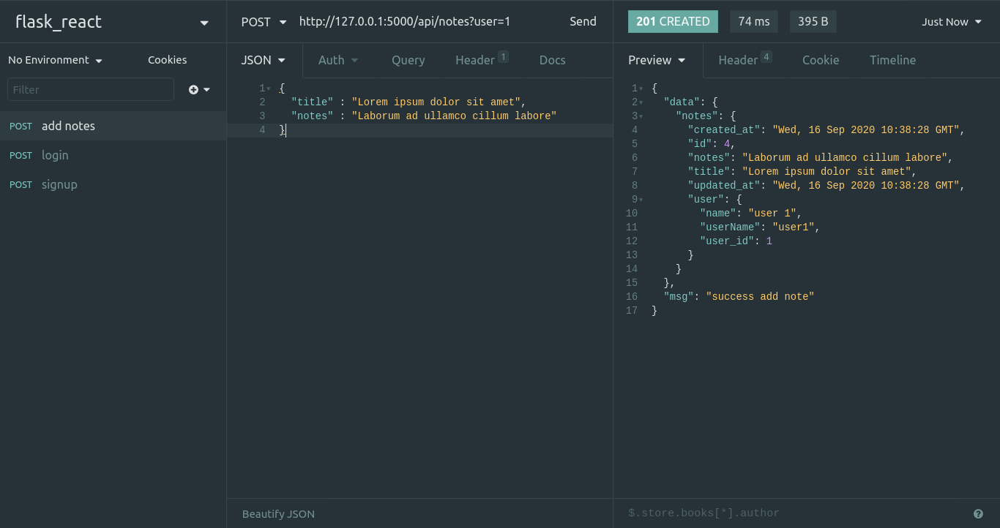
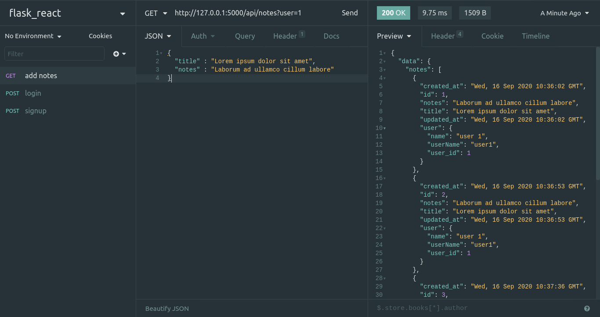
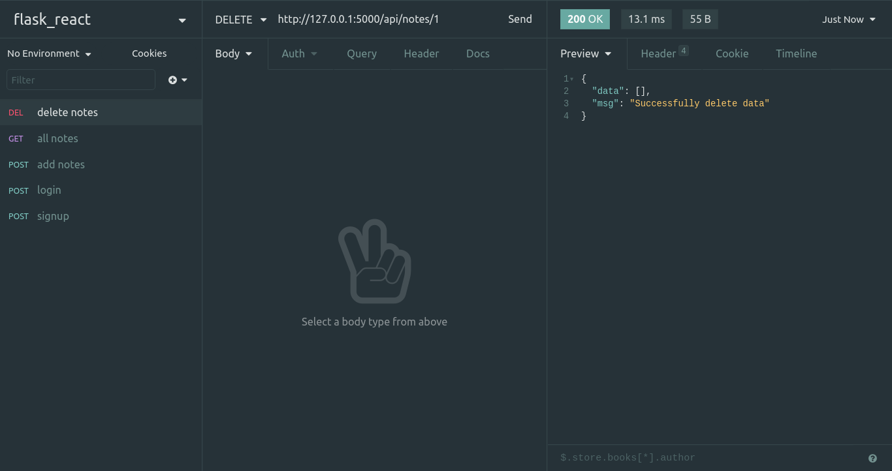

### Membuat endpoint

Sekarang kita akan melanjutkan dengan membuat endpoint dari REST API kita untuk memanggil controller yang sudah kita buat. Berdasarkan desain yang sudah kita buat kita akan membuat 8 endpoint. Untuk membuat endpointnya, buat dulu file `route.py` di folder `app`. Lalu kita isi seperti berikut

```python
from app import app, response
from flask import request
from app.controller import UsersController, NotesController

@app.route('/api/signup', methods=['POST'])
def signup():
    if request.method == 'POST':
        return UsersController.signup()
    else:
        return response.METHOD_NOT_ALLOWED([],"Wrong HTTP method")

@app.route('/api/login', methods=['POST'])
def login():
    if request.method == 'POST':
        return UsersController.login()
    else:
        return response.METHOD_NOT_ALLOWED([],"Wrong HTTP method")

@app.route('/api/users/<int:id>', methods=['GET'])
def users_by_id(id):
    if request.method == 'GET':
        return UsersController.show(id)
    else:
        return response.METHOD_NOT_ALLOWED([],"Wrong HTTP method")
        
@app.route('/api/notes', methods=['GET','POST'])
def notes():
    if request.method == 'GET':
        return NotesController.index()
    elif request.method == 'POST':
        return NotesController.add()
    else :
        return response.METHOD_NOT_ALLOWED([], "Wrong HTTP method")

@app.route('/api/notes/<int:id>', methods=['GET','PUT','DELETE'])
def notes_by_id(id):
    if request.method == 'PUT':
        return NotesController.edit(id)
    elif request.method == 'GET':
        return NotesController.show(id)
    elif request.method == 'DELETE':
        return NotesController.delete(id)
    else:
        return response.METHOD_NOT_ALLOWED([], "Wrong HTTP method")
```

Nah disini kita akan membuat 8 endpoint tadi beserta method nya. Dari masing-masing endpoint, kita harus mengecek method apa aja yang boleh dilakukan di endpoint tersebut, lalu dari setiap HHTP method yang dibolehkan kita arahkan ke Controller yang sesuai yang sudah kita buat pada part sebelumnya. Lalu import endpoint yang sudah kita buat di `__init__.py` yang ada di folder `app`.

```python
from flask import Flask
from config import Config
from flask_sqlalchemy import SQLAlchemy
from flask_migrate import Migrate

app = Flask(__name__)
app.config.from_object(Config)

db = SQLAlchemy(app)

migrate = Migrate(app, db)

from app import route, response
from app.model import Notes, Users 
```

Setelah beres, saatnya kita mencoba API yang sudah kita buat

### Testing API menggunakan Insomnia

```
POST   /api/users/signup
POST   /api/users/login
GET    /api/users/<id>

POST   /api/notes
GET    /api/notes
GET    /api/notes/<id>
PUT    /api/notes/<id>
DELETE /api/notes/<id>
```

Yang akan saya cek pertama adalah signup dan login terlebih dahulu. Jangan lupa untuk menghidupkan mysql dan menjalankan flask dengan perintah `flask run`. Buat request baru dengan url [`http://127.0.0.1:5000/api/signup`](http://127.0.0.1:5000/api/signup) dan method `POST`. Karena flask jalan di [`http://127.0.0.1:5000`](http://127.0.0.1:5000/api/signup) maka untuk mengakses endpoint yang sudah kita buat tinggal tambahkan saja dibelakangnya.  Untuk endpoint signup, kita tadi membuat request nya adalah json, maka tambahkan di Body→JSON, lalu isikan dengan data yang sesuai dengan di controller nya. Sebagai contoh

```json
{
	"name" : "user 1",
	"userName" : "user1",
	"password" : "12345"
}
```



Jika berhasil akan muncul seperti diatas.

Lalu dari data user yang kita dapatkan dari proses signup tadi, kita mencoba untuk login. Buat request baru dengan method `POST` di URL yang disesuaikan dengan endpoint login. Lalu untuk request yang dibutuhkan hanya `userName` dan `password.`



Kita bisa mencoba jika data yang dikirimkan salah maka response yang diberikan, seperti berikut



Sekarang kita mencoba untuk menambah notes, karena user yang sudah saya buat adalah `user i` dan memiliki id `1` ya kita buat menggunakan id itu. Buat request `POST` dengan url [`http://127.0.0.1:5000/api/notes?user=1`](http://127.0.0.1:5000/api/notes?user=1) dan isikan data berikut.

```json
{
	"title" : "Lorem ipsum dolor sit amet",
	"notes" : "Laborum ad ullamco cillum labore"
}
```



Untuk melihat semua notes dari user 1, rubah method `POST` menjadi `GET`, lalu body kosongkan saja, maka akan muncul semua notes dari user 1.



Lalu anda bisa mencoba menghapus, mengedit, dan melihat notes by id seperti berikut. Untuk mendelete notes kita harus tau id dari notes yang akan kita hapus. Lalu buat method `DELETE` dan url nya [`http://127.0.0.1:5000/api/notes/<id>`](http://127.0.0.1:5000/api/notes/1), id disesuaikan dengan id dari notes yang akan didelete.



Jika pertama kali mendelete maka response nya akan `200 OK`, namun delete selanjutnya maka akan menampilkan `204 NO CONTENT`. Lakukan hal yang sama jika kita mau melihat sebuah notes berdasarkan id nya, dan untuk mengedit notes yang sudah ada tambahkan body JSON dari data baru yang diedit. Semua dapat dipanggil dengan hanya mengganti method nya saja. Nah sekarang anda bisa mencoba semua endpoint yang sudah dibuat, baik dengan format yang salah. 
