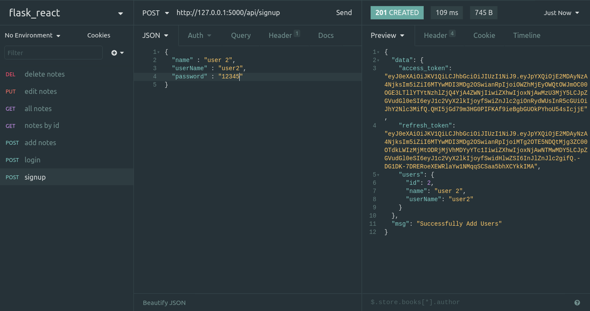
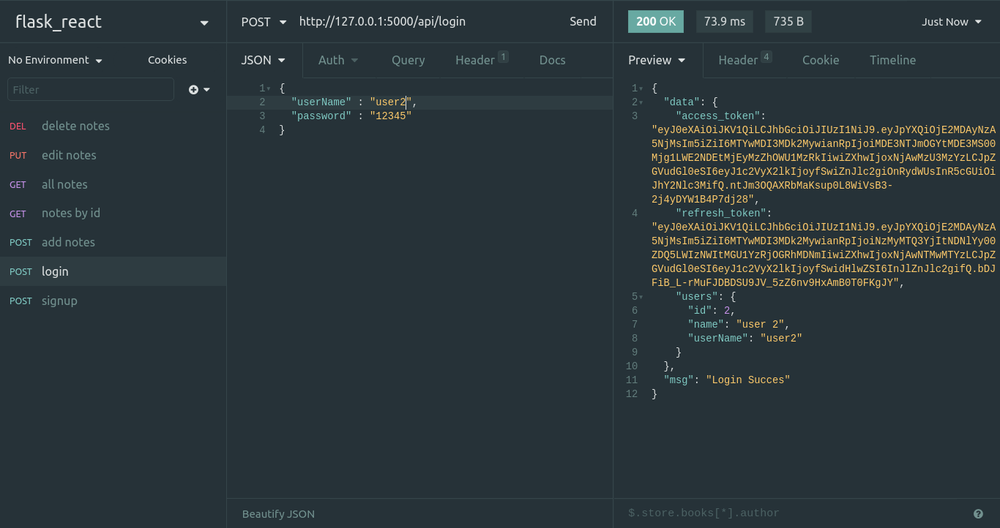
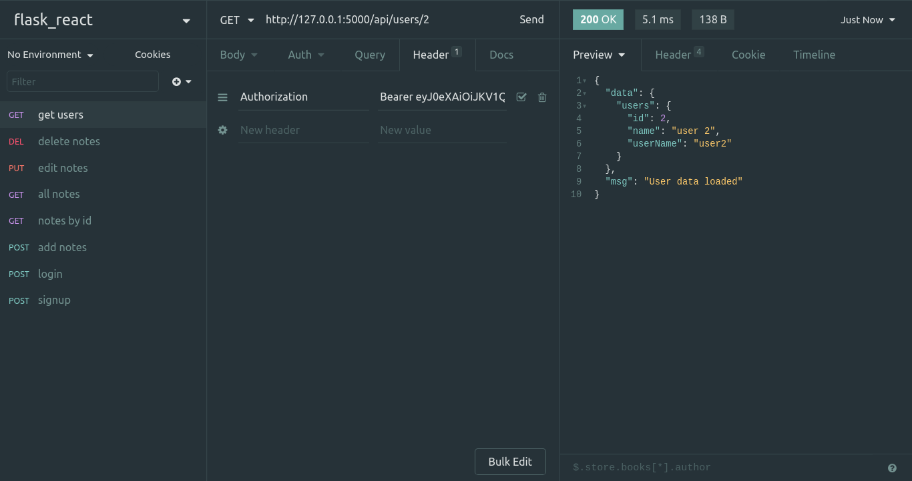
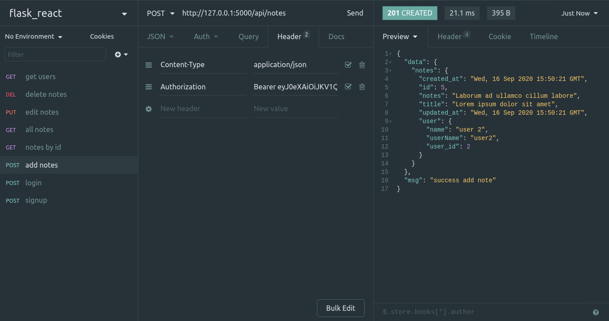

### JSON Web Token

Salah satu hal yang paling penting dalam sebuah aplikasi adalah authorization dan authentication. Authentication yaitu memverifikasi suatu entitas, biasanya user, bahwa entitas tersebut benar benar entitas tersebut. Authentication biasanya terdapat pada proses login. Lalu authorization adalah memberikan wewenang  kepada sebuah entitas, misal user. Sebagai contoh aplikasi yang akan kita buat, kita ingin user lain tidak bisa melihat data notes kita dan kita tidak bisa melihat notes dari user lain.


Kita akan menggunakan JWT atau JSON Web Token. Apa sih JSON Web Token? jadi JSON Web Token atau JWT ini adalah token yang digunakan untuk proses authorization. JWT itu terdiri dari tiga bagian, yaitu `header`, `payload`, dan `signature`. Header berisi informasi algoritma enkripsi yang digunakan. Payload ini isinya data, biasanya data-data sederhana yang bisa kita pakai untuk verifikasi. Yang terakhir signature, nah signature ini adalah token yang dibuat berdasarkan `secret code` yang kita buat di server. Untuk header dan payload kita bisa melakukan dekripsi sehingga kita bisa tau, namun untuk signature tidak bisa di dekrisi karena harus sesuai dengan `secret code` yang hanya dimiliki server, maka data-data yang berada di payload bukan data vital, seperti password dsb. Untuk lebih lengkap anda bisa membacanya [disini](https://jwt.io/introduction/).

Untuk menggunakan JWT kita harus membuat secret key nya dulu. Buka `.flaskenv` lalu tambahkan 

```
JWT_SECRET=secret
```

Ganti kata `secret` dengan kata yang anda sukai. Lalu di file `[config.py](http://config.py)` tambahkan juga atribut `JWT_SECRET_KEY`, seperti berikut

```python
JWT_SECRET_KEY = str(os.environ.get("JWT_SECRET"))
```

Lalu di `__init__.py` di folder `app` dan kita edit seperti berikut

```python
from flask import Flask
from config import Config
from flask_sqlalchemy import SQLAlchemy
from flask_migrate import Migrate
from flask_jwt_extended import JWTManager

app = Flask(__name__)
app.config.from_object(Config)

db = SQLAlchemy(app)

migrate = Migrate(app, db)

jwt = JWTManager(app)

from app import route, response
from app.model import Notes, Users
```

Setelah kita menambahkan konfigurasi untuk JWT, sekarang kita tinggal mengaplikasikannya di controller yang kita inginkan. Sebelum memulai, kita akan mengenal beberapa istilah yang harus kita tau terlebih dahulu dari `flask_jwt_extended`.

- `jwt_required` digunakan untuk memproteksi endpoint agar hanya bisa diakses jika memiliki JWT.
- `create_access_token`, untuk membuat access_token yang akan kita gunakan untuk mengakses semua endpoint yang diproteksi dengan `jwt_required`.
- `create_refresh_token`, untuk me-refresh access_token yang sudah expired.
- `get_jwt_identity`, untuk mengambil payload dari JWT.

JWT akan digenerate setelah kita login atau register user. Untuk itu, kita buat dulu function yang menggenerate JWT. Buka `[UsersController.py](http://userscontroller.py)` lalu edit menjadi seperti ini

```python
import datetime
from app.model.Users import Users
from flask import request
from app import response, db
from flask_jwt_extended import create_access_token, create_refresh_token, jwt_required, get_jwt_identity

def signup():
    try:
        name = request.json['name'].strip()
        user_name = request.json['userName'].strip()
        password = request.json['password']

        user = Users(name=name, user_name=user_name)
        user.setPassword(password)
        db.session.add(user)
        db.session.commit()

        access_token, refresh_token = getToken(user.id)
        
        return response.CREATED({
            "users" : singleTransform(user),
            "access_token": access_token,
            "refresh_token": refresh_token,
        }, 'Successfully Add Users')

    except Exception as e:
        return response.INTERNAL_SERVER_ERROR([], "Internal server error")

def login():
    try:
        user_name = request.json['userName'].strip()
        password = request.json['password']
        user = Users.query.filter_by(user_name=user_name).first()
        if not user:
            return response.NOT_FOUND([], 'No user found')
        if not user.checkPassword(password):
            return response.UNAUTHORIZED([], 'Your credentials is invalid')

        access_token, refresh_token = getToken(user.id)    

        return response.OK({
            "users" : singleTransform(user),
            "access_token": access_token,
            "refresh_token": refresh_token,
        }, "Login Succes")

    except Exception as e:
        return response.INTERNAL_SERVER_ERROR('', "Failed to login")
        

@jwt_required
def show(id):
    try:
        current_user = get_jwt_identity()
        if current_user and current_user['user_id'] == id:
            user = Users.query.filter_by(id=current_user['user_id']).first()
            if not user:
                return response.NOT_FOUND([], 'No user found')

            data = singleTransform(user)

            return response.OK({
                "users" : data
            }, "User data loaded")

        else:
            return response.UNAUTHORIZED([], "Your credential is invalid")

    except Exception as e:
        return response.INTERNAL_SERVER_ERROR([], "Failed to login")

def getToken(id):
    expires = datetime.timedelta(days=1)
    expires_refresh = datetime.timedelta(days=3)
    access_token = create_access_token({'user_id': id}, fresh=True, expires_delta=expires)
    refresh_token = create_refresh_token({'user_id': id}, expires_delta=expires_refresh)

    return access_token, refresh_token

def transform(values):
    array = []
    for i in values:
        array.append(singleTransform(i))
    return array

def singleTransform(User):
    return {
        'id': User.id,
        'name': User.name,
        'userName': User.user_name
    }
```

Saya membuat JWT dengan payload nya hanya berisi `user_id` dengan menggunakan function `getToken` yang mengenerate access_token dan refresh_token dengan expired date nya 1 hari dan 3 hari. Pada saat function `login` dan `signup` dipanggil maka akan mengembalikan response yang berisi data user, dan JWT Web Tokens. Penggunaan JWT Web Token terlihat pada function `show`, kita bisa mendapatkan data dari payload JWT menggunakan `get_jwt_identity` dan kita bisa mengakses data `user_id` nya. Jika JWT Web Tokennya tidak falid maka `get_jwt_identity` akan tidak ada nilainya. Proses yang sama akan kita lakukan juga di `NotesController.py`

```python
from flask import request
from app import response, db
from app.model.Notes import Notes
from flask_jwt_extended import jwt_required, get_jwt_identity

@jwt_required
def index():
    try:
        current_user = get_jwt_identity()
        if current_user:
            notes = Notes.query.filter_by(user_id=current_user['user_id'])
            if not notes:
                return response.NOT_FOUND([],"No notes found")

            data = transform(notes)

            return response.OK({
                "notes" : data
            }, "All note")
        else:
            return response.UNAUTHORIZED([], "Your credential is invalid")
    except Exception as e:
        print(e)
        return response.INTERNAL_SERVER_ERROR([], "Failed to load note")

@jwt_required
def add():
    try:
        current_user = get_jwt_identity()
        if current_user:
            title = request.json['title'].strip()
            notes = request.json['notes'].strip()

            note = Notes(user_id=current_user['user_id'], title=title, notes=notes)
            db.session.add(note)
            db.session.commit()

            data = singleTransform(note)

            return response.CREATED({
                "notes" : data
            }, "success add note")
        else:
            return response.UNAUTHORIZED([], "Your credential is invalid")
    except Exception as e:
        print(e)
        return response.INTERNAL_SERVER_ERROR([], "Failed to load note")

@jwt_required
def show(id):
    try:
        current_user = get_jwt_identity()
        if current_user:
            note = Notes.query.filter_by(user_id=current_user['user_id'],id=id).first()
            if not note:
                return response.NOT_FOUND([],"No notes found")

            data = singleTransform(note)

            return response.OK({
                "notes" : data
            }, "notes by id")

        else:
            return response.UNAUTHORIZED([], "Your credential is invalid")
    except Exception as e:
        return response.INTERNAL_SERVER_ERROR([], "Failed to load note")

@jwt_required
def edit(id):
    try:
        current_user = get_jwt_identity()
        if current_user:
            note = Notes.query.filter_by(user_id=current_user['user_id'],id=id).first()
            if not note:
                return response.NOT_FOUND([],"No notes found")

            note.title = request.json['title']
            note.notes = request.json['notes']
            db.session.add(note)
            db.session.commit()

            data = singleTransform(note)

            return response.CREATED({
                "notes" : data
            }, "Success edit note")
        else:
            return response.UNAUTHORIZED([], "Your credential is invalid")
    except Exception as e:
        return response.INTERNAL_SERVER_ERROR([], "Failed to edit note")

@jwt_required
def delete(id):
    try:
        current_user = get_jwt_identity()
        if current_user:
            note = Notes.query.filter_by(id=id).first()
            if not note:
                return response.NO_CONTENT([], "No data deleted")
            
            db.session.delete(note)
            db.session.commit()

            return response.OK([], "Successfully delete data")

        else:
            return response.UNAUTHORIZED([], "Your credential is invalid")
    except Exception as e:
        return response.INTERNAL_SERVER_ERROR([], "Failed to delete")

def transform(values):
    array = []
    for i in values:
        array.append(singleTransform(i))
    return array

def singleTransform(values):
    data = {
        'id': values.id,
        'title': values.title,
        'notes': values.notes,
        'created_at': values.created_at,
        'updated_at': values.updated_at,
        'user': {
            'user_id' : values.user.id,
            'name' : values.user.name,
            'userName': values.user.user_name
        }
    }

    return data
```

Disini terdapat beberapa perubahan dari yang sebelumnya. Pada `NotesController` sebelumnya, kita menggunakan `user_id = request.args.get('user')` untuk mengambil user_id, sekarang kita mengambil user_id melalui PayLoad dari JWT. 

### Testing lagi

Setelah semuanya sudah diimplementasikan, sekarang kita lakukan testing lagi menggunakan Insomnia. Saya mencoba mendaftar user baru



Response yang diberikan terdapat `access_token` dan `refresh_token`. Begitu juga jika kita login



Jika kita meminta data user dengan menggunakan endpoint `api/users/<id>` maka akan response yang diberikan adalah

```json
{
  "msg": "Missing Authorization Header"
}
```

Oleh karena itu, kita harus menambahkan header di request yaitu `Authorization` dan value nya `Bearer <access_token>`. Access_token nya adalah access_token yang kita dapatkan waktu login atau register tadi. Kira kira seperti ini 



Kita harus memasukkan `Authorization` header untuk setiap request yang membutuhkan JWT. Sebagai contoh saat menambah notes.



Kita bisa mencobanya dengan berbagai skenario kegagalan, misal tidak menggunakan token, token dirubah, token expired, dsb, maka response tidak akan muncul. 

Implementasi JWT sudah selesai, gampang kan?. Proses pembuatan REST API pada tutorial kali ini juga sudah selesai. Selanjutnya kita akan mencoba untuk membuat REST Client yang mengkonsum API yang sudah kita buat.