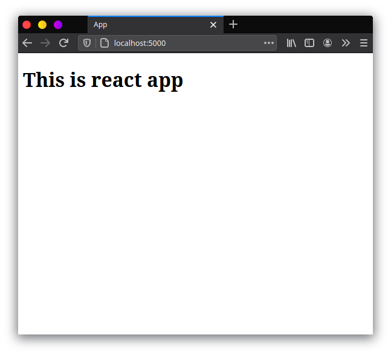

### Penjelasan Singkat

```json
├── app
│   ├── controller
│   ├── model
│   ├── static
│   └── templates
├── env
└── src
```

Sebelum memulai project frontend kita, saya akan menjelaskan terlebih dahulu apa saja yang harus anda ketahui. Untuk front end kita akan menggunakan React JS dengan webpack tentunya dan kita akan menginstallnya manual, bukan menggunakan `create-react-app`. Ketika kita membuild project react kita, maka webpack akan mem-bundle file JS kita. Nah jika biasanya kita menggunakan react js hasil bundle nya ada di folder `dist`, pada kali ini saya akan taruh hasil build nya di `app/static`. Kita buat juga `index.html` di `app/templates`, yang akan diload saat flask nya diaktifkan.

Lalu untuk routing di frontend, kita menggunakan `react-router-dom`. Mungkin kita akan kepkiran, apa nggak bentrokan antara routing dari react js dan flask nya kalo kita pake `react-router-dom`?. Jelas akan terjadi hal kayak gitu. Biar gak kayak gitu, kita buat flask nya hanya menampilkan `index.html` untuk setiap route nya. jadi yang mengatur router di browser ya `react-router-dom` nya.  Untuk itu sekarang kita edit dulu `route.py` nya dan tambahkan route kayak gini

```python
@app.route('/', defaults={'path': ''})
@app.route('/<path:path>')
def catch_all(path):
    return render_template('index.html')
```

Lalu buat file `index.html` di folder `templates` dan isikan seperti dibawah ini

```html
<!DOCTYPE html>
<html lang="en">
<head>
    <meta charset="UTF-8">
    <meta name="viewport" content="width=device-width, initial-scale=1.0">
    <title>App</title>
</head>
<body>
    
    <div id="root"></div>
    
    <script src="{{ url_for('static', filename='bundle.js') }}"></script>
    
</body>
</html>
```

Sekarang kalau kita buka aplikasi flask nya di `[localhost:5000](http://localhost:5000)` kita akan mendapatkan blank html yang isinya cuma `#root` saja. Lalu untuk `bundel.js` nanti akan dibuild menggunakan react js.

Untuk menginstall react, kita harus membuat project node js terlebih dahulu.

```python
npm init
```

isikan sesuai yang anda inginkan. Lalu kita harus menginstall beberapa dependency yang dibutuhkan untuk di frontend, seperti react js dan teman teman nya.

### Menginstall Dependency

Pertama kita install dulu react js

```bash
npm install react react-dom --save
```

Lalu install loader nya, disini saya menggunakan babel sebagai loadernya

```bash
npm install babel-loader @babel/core @babel/preset-env @babel/preset-react @babel/plugin-transform-runtime --save-dev
```

Setelah menginstall babel, kita buat konfigurasi untuk babel nya. buat file `.babelrc` di root project kita, lalu isikan sebagai berikut.

```json
{
  "presets": [
    "@babel/preset-env", 
    "@babel/preset-react"
  ],
  "plugins": [
    "@babel/plugin-transform-runtime"
  ]
}
```

Setelah menginstall babel, kita install bundler nya. Namun sebelum menginstall bundlernya, kita menginstall styele-loader agar kita bisa me-load style seperti css ataupun css. Jika anda hanya ingin menggunakan css saja install seperti berikut

```bash
npm i css-loader style-loader --save-dev
```

Lalu jika anda ingin menggunakan scss atau sass, kita install **juga** package dibawah ini. BTW saya disini menggunakan sass.

```bash
npm i sass-loader node-sass --save-dev
```

Jika saat menginstall package ada kendala, coba hapus cache nya dulu kemudian install lagi

```bash
npm cache clean --force
```

Setelah menginstall babel dan style loader nya, kita bisa menginstall bundlernya. disini saya menggunakan webpack

```bash
npm install webpack webpack-cli --save-dev
```

Disini kita akan menggunakan dua konfigurasi, satu untuk saat production dan satu untuk development. buat file `webpack.config.js` lalu isikan kode berikut

```jsx
const path = require("path")

module.exports = {
  entry: "./src/index.js",
  output: {
    path: path.join(__dirname, 'app/static'),
    filename: "bundle.js"
  },
  module: {
    rules: [
      {
        test: /\.(js|jsx)$/,
        exclude: /node_modules/,
        loader: 'babel-loader'
      },
      {
        test: /\.(css)$/,
        loader: ['style-loader','css-loader']
      },
      {
        test: /\.(scss|sass)$/,
        use: ['style-loader', 'css-loader', 'sass-loader']
      }
    ]
  },
  devtool: "cheap-module-eval-source-map"
}
```

Lalu buat file lagi `webpack.config.prod.js`

```jsx
const path = require("path")

module.exports = {
  entry: "./src/index.js",
  output: {
    path: path.join(__dirname, 'app/static'),
    filename: "bundle.js"
  },
  module: {
    rules: [
      {
        test: /\.(js|jsx)$/,
        exclude: /node_modules/,
        loader: 'babel-loader'
      },
      {
        test: /\.(css)$/,
        loader: ['style-loader','css-loader']
      },
      {
        test: /\.(scss|sass)$/,
        use: ['style-loader', 'css-loader', 'sass-loader']
      }
    ]
  },
  devtool: ""
}
```

Pada konfigurasi webpack ini, outputnya akan ditaro di `app/static` dengan nama `bundle.js` yang kemudian akan diload oleh `index.html` yang sudah kita buat. Lalu kita tambahkan script di `package.json` agar kita bisa menjalankan ataupun membuild nya.

```json
...
"scripts": {
    "start": "webpack --mode=development",
    "build": "webpack --mode=production --config=webpack.config.prod.js",
    "watch": "webpack --mode=development --watch"
  },
...
```

### Membuat components React sederhana

Semua file React akan berada di folder `src` , dengan file utamanya adalah `index.js`. Sekarang buat `index.js` di folder `src` lalu buat component sederhana seperti berikut.

```jsx
import React from 'react'
import ReactDOM from 'react-dom'

const App = () => {
  return (
    <div>
      <h1>This is react app</h1>
    </div>
  )
}

ReactDOM.render(<App/>, document.getElementById("root"))
```

 Lalu jalankan `npm run start` jika kita ingin membuild nya sekali saja, jika anda ingin membuild setiap ada perubahan, kita bisa menggunakan `npm run watch`. Jika kita perhatikan, ada file `bundle.js` di folder `app/static` yang terbuat, dan jika anda buka `[localhost:5000](http://localhost:5000)` maka muncul seperti berikut.



Sekarang kita sudah bisa menjalankan frontend React kta. Selanjutnya kita akan membuat routin untuk login page, register page, dan notes page.

### Membuat routing di frontend

Sebelum membuat routing, kita install dulu

```bash
npm install react-router-dom --save
```

Lalu kita tambahkan routing di frontend kita. Buka file `index.js` lalu edit menjadi seperti berikut.

```jsx
import React from "react";
import ReactDOM from "react-dom";
import { BrowserRouter, Switch, Route } from "react-router-dom";
import Login from "./Login";
import Notes from "./Notes";
import Signup from "./Signup";

const App = () => {
  return (
    <BrowserRouter>
      <Switch>
        <Route path="/signup">
          <Signup />
        </Route>
        <Route path="/login">
          <Login />
        </Route>
        <Route path="/">
          <Notes /> 
        </Route>
      </Switch>
    </BrowserRouter>
  );
};

ReactDOM.render(<App/>, document.getElementById("root"))
```

Kita butuh tiga component react js untuk di render di masing masing route, yaitu `Notes.js`, `Signup.js`, dan `Login.js`. Kita buat ketiga file tersebut di folder yang sama dengan `index.js` di folder `src` . Isikan kode seperti berikut untuk ketiga component tersebut.

```jsx
import React from 'react'

const Login = () => {
  return (
    <div>
      Login page
    </div>
  )
}

export default Login
```

Lalu jalankan `npm run start` dan reload `[localhost:5000](http://localhost:5000)`. Sekarang jika kita membuka `localhost:5000/login`, `localhost:5000/signup`, dan `localhost:5000` maka akan muncul sesuai dengan tiga component yang kita buat tadi.