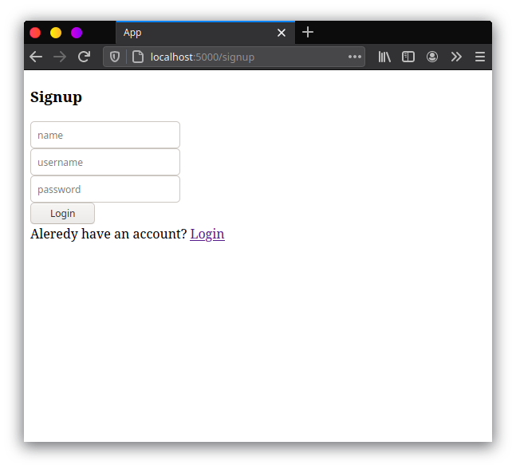
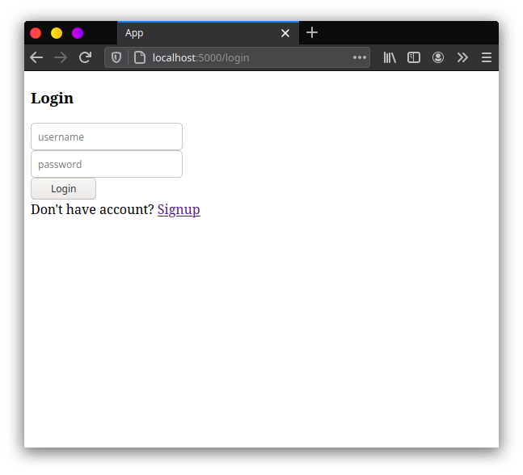

Sekarang kita akan edit `Login.js`, `Signup.js`, dan `Notes.js` agar bisa mengambil data dari API. Untuk `Signup.js` saya buat form sederhana seperti berikut.



```jsx
import React, { useState, useContext } from "react";
import { useHistory, Link } from "react-router-dom";
import AuthContext from "./AuthContext";
import { signup } from "./ApiConsumer";

const Signup = () => {
  const history = useHistory();
  const { setLogin } = useContext(AuthContext);
  const [name, setName] = useState("");
  const [userName, setUserName] = useState("");
  const [password, setPassword] = useState("");

  const sendData = async () => {
    let data = {
      name: name,
      userName: userName,
      password: password,
    };
    try {
      const signupSuccess = await signup(data);
      setLogin(signupSuccess);
      if (signupSuccess) {
        history.push("/");
      }
    } catch (error) {
      console.log(error);
    }
  };

  return (
    <div>
      <div>
        <div>
          <h3>Signup</h3>
        </div>
        <div>
          <input
            type="text"
            value={name}
            onChange={(e) => setName(e.target.value)}
            placeholder="name"
          ></input>
        </div>
        <div>
          <input
            type="text"
            value={userName}
            onChange={(e) => setUserName(e.target.value)}
            placeholder="username"
          ></input>
        </div>
        <div>
          <input
            type="password"
            value={password}
            onChange={(e) => setPassword(e.target.value)}
            placeholder="password"
          ></input>
        </div>
        <div>
          <button onClick={() => sendData()}>Login</button>
        </div>
        <div>
          Aleredy have an account? <Link to="/login">Login</Link>
        </div>
      </div>
    </div>
  );
};

export default Signup;
```

Nah disini kita akan membuat 3 input, yaitu username, password, dan name. Lalu data tersebut dikirimkan menggunakan function `signup` yang sudah kita buat di `ApiConsumer` secara asynchronous. Lalu jika login success, kita akan diarahkan ke `localhost:5000`. Dengan cara yang sama, kita membuat untuk `Login.js`



```jsx
import React, { useState, useContext } from "react";
import AuthContext from "./AuthContext";
import { login } from "./ApiConsumer";
import { useHistory, Link } from "react-router-dom";

const Login = () => {
  const history = useHistory();
  const { setLogin } = useContext(AuthContext);
  const [userName, setUserName] = useState("");
  const [password, setPassword] = useState("");

  const sendData = async () => {
    let data = {
      userName: userName,
      password: password,
    };
    try {
      const loginSuccess = await login(data);
      setLogin(loginSuccess);
      if (loginSuccess) {
        history.push("/");
      }
    } catch (error) {
      console.log(error);
    }
  };

  return (
    <div>
      <div>
        <div>
          <h3>Login</h3>
        </div>
        <div>
          <input
            type="text"
            value={userName}
            onChange={(e) => setUserName(e.target.value)}
            placeholder="username"
          ></input>
        </div>
        <div>
          <input
            type="password"
            value={password}
            onChange={(e) => setPassword(e.target.value)}
            placeholder="password"
          ></input>
        </div>
        <div>
          <button className="btn-center" onClick={() => sendData()}>
            Signup
          </button>
        </div>
        <div>
          Don't have account? <Link to="/signup">Signup</Link>
        </div>
      </div>
    </div>
  );
};

export default Login;
```

Setelah membuat `Login.js` dan `Signup.js` kita perlu memproteksi router `[localhost:5000](http://localhost:5000)` agar hanya bisa diakses ketika sudah login ataupun register. Kita bisa menggunakan `AuthContext` tadi. Maka kita edit dulu `index.js` seperti berikut

```jsx
import React, { useContext } from "react";
import ReactDOM from "react-dom";
import { BrowserRouter, Switch, Route, Redirect } from "react-router-dom";
import AuthContext, { AuthProvider } from "data/AuthContext";
import Login from "./Login";
import Notes from "./Notes";
import Signup from "./Signup";

const App = () => {
  const { isLogin } = useContext(AuthContext);
  return (
    <BrowserRouter>
      <Switch>
        <Route path="/signup">
          {!isLogin ? <Signup /> : <Redirect to="/" />}
        </Route>
        <Route path="/login">
          {!isLogin ? <Login /> : <Redirect to="/" />}
        </Route>
        <Route path="/">
          {isLogin ? <Notes /> : <Redirect to="/login" />}
        </Route>
      </Switch>
    </BrowserRouter>
  );
};

ReactDOM.render(
  <AuthProvider>
    <App />
  </AuthProvider>,
  document.getElementById("root")
);
```

Jadi ketika user belum login, maka si router akan me-redirect ke halaman login. Langkah selanjutnya adalah membuat CRUD notes menggunakan API yang sudah kita buat dan logout. Kita buat sederhana seperti berikut


Kodenya seperti berikut

```jsx
import React, {  useState, useEffect, useContext } from "react";
import { getNotes, deleteNotesById, addNotes, editNotesById } from "./ApiConsumer";
import AuthContext from "./AuthContext"

const Notes = () => {
  const {logout} = useContext(AuthContext)
  const [notesData, setNotesData] = useState([]);
  const [title, setTitle] = useState("")
  const [notes, setNotes] = useState("")
  const [notesId, setNotesId] = useState(null)

  useEffect(() => {
    fetchNotes();
  }, []);

  //load all notes data
  const fetchNotes = async () => {
    try {
      const result = await getNotes();
      setNotesData(result);
    } catch (error) {
      console.log(error);
    }
  };

  //delete notes by id
  const deletNotes = async (id) => {
    try {
      await deleteNotesById(id);
      const newNotes = notesData.filter((item)=> item.id!==id)
      setNotesData(newNotes)
    } catch (error) {
      console.log(error);
    }
  }

  //create new notes and update the state
  const add = async () => {
    try {
      await addNotes({
        title: title,
        notes: notes,
      });
      removeState()
      fetchNotes()
    } catch (error) {
      console.log(error);
    }
  };

  //edit new notes and update the state
  const edit = async () => {
    try {
      await editNotesById(notesId, {
        title: title,
        notes: notes,
      });
      removeState()
      fetchNotes()
    } catch (error) {
      console.log(error);
    }
  };

  const handleEdit = (id, title, notes) => {
    setNotesId(id)
    setTitle(title)
    setNotes(notes)
  }

  //button handler for Add/edit button
  const handleBtn = () => {
    if (notesId) return edit()
    return add()
  }

  //reset the state to default
  const removeState = () => {
    setNotes("")
    setNotesId(null)
    setTitle("")
  }

  return (
    <div>
      <button onClick={()=>logout()}>Logout</button>
      <div>
        <input type="text" placeholder="title" onChange={(e)=>setTitle(e.target.value)} value={title} />
        <input type="text" placeholder="notes" onChange={(e)=>setNotes(e.target.value)} value={notes} />
        <div>
          <button onClick={()=>removeState()}>Cancel Add/edit</button>
          <button onClick={()=>handleBtn()}>Add/Edit</button>
        </div>
      </div>
      <div>
        {notesData.map(({ id, title, notes }) => {
          return (
            <div key={id}>
              <div>{title}</div>
              <div>{notes}</div>
              <button onClick={()=>deletNotes(id)}>Delete</button>
              <button onClick={()=>handleEdit(id, title, notes)}>Edit</button>
            </div>
          )
        })}
      </div>
    </div>
  );
};

export default Notes;
```

Sekarang kita sudah bisa mengaplikasikan CRUD Notes menggunakan ApiConsumer yang sudah kita buat dan logout button juga sudah dibuat. Selanjutnya anda bisa menambah style sendiri sehingga tampilannya menjadi menarik. 

Tutorial sederhan Flask+React js: REST API sudah selesai. Saya hanya berbagi sedikit dari apa yang saya pelajari, anda bisa merubah dan menambah apa yang saya lakukan di tutorial ini. Pada tutorial ini masih terdapat beberapa hal yang tidak saya lakukan. Mungkin anda bisa memanipulasi dan eksperimen sendiri. Diantaranya yang tidak saya lakukan adalah

- Mengaplikasikan Refresh Token jika Token Expired
- Membuat Component React JS yang bagus

Sisanya anda tinggal berkreasi sendiri. Tutorial ini hanya sebagai sarana saya memahami REST API dan menggunakannya. Sip!!!. Sampai Jumpa.